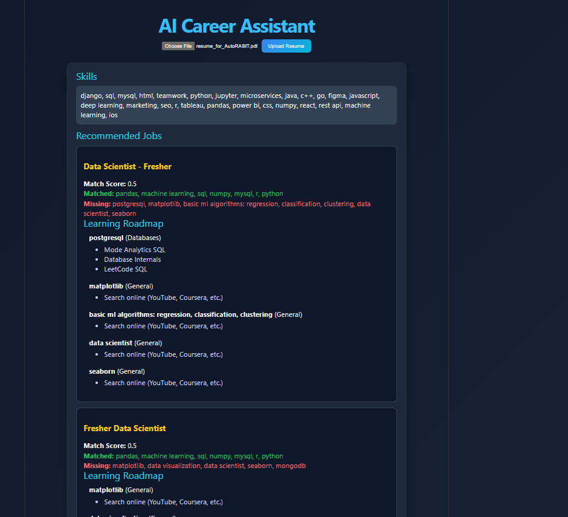

# 🚀 AI Career Assistant

An AI-powered platform that analyzes resumes, extracts skills, recommends jobs, and provides a personalized learning roadmap to bridge skill gaps.

---

## 🔄 System Flow

Upload Resume
↓
Extract Text
↓
Extract Skills
↓
Match Jobs
↓
Identify Skill Gaps
↓
Generate Learning Roadmap
↓
Show Results

---

## ✅ MVP Features

* 📄 Resume Upload (PDF → Text)
* 🧠 Skill Extraction (Text → Skills)
* 🎯 Job Recommendation (Skills → Jobs + Match Score)
* 📉 Skill Gap Analyzer (Missing Skills Identification)
* 🗺️ Learning Roadmap (Skills → Categorized Resources)

---

## ⚙️ What’s Implemented

* FastAPI backend
* Resume upload API
* PDF text extraction
* Dynamic skill extraction using dataset
* Job matching using real-world job data
* Skill gap analysis
* Categorized learning roadmap generation
* Modular backend architecture

---

## 🔗 API Documentation

### Swagger UI (Test APIs here)

```text
http://127.0.0.1:8000/docs
```

---

## 🔗 API Endpoint

### Upload Resume

```http
POST /upload-resume
```

---

## 📥 Example Response

```json
{
  "filename": "resume.pdf",
  "skills": ["python", "sql"],
  "recommended_jobs": [
    {
      "job_title": "Data Scientist",
      "match_score": 0.6,
      "matched_skills": ["python", "sql"],
      "missing_skills": ["machine learning", "tensorflow"],
      "learning_roadmap": [
        {
          "skill": "machine learning",
          "category": "Data Science & AI",
          "resources": [
            "Andrew Ng ML Course (Coursera)",
            "Kaggle"
          ]
        }
      ]
    }
  ]
}
```

---

## 🛠️ Tech Stack

* Backend: FastAPI
* NLP: Text processing + dataset-driven matching
* Data: Skills dataset + job dataset
* Architecture: Modular (feature-based)

---
## ⚙️ Installation & Setup
### 🔹 1. Clone Repository
```bash
git clone https://github.com/AnnapurnaAdhikari/JobFitAI.git
cd JobFitAI
```
### 🔹 2. Setup Backend (FastAPI)
```bash
cd backend
pip install -r requirements.txt
```
#### Run backend server:
```bash
uvicorn main:app --reload
```

#### Backend will run at:
```text
http://127.0.0.1:8000
```
#### Swagger UI:
```text
http://127.0.0.1:8000/docs
```

### 🔹 3. Setup Frontend (React)
```bash
cd frontend
npm install
npm start
```
Frontend will run at:
```text 
http://localhost:5173/
```
---

## 📌 Current Status

* ✅ Resume parsing
* ✅ Skill extraction
* ✅ Job recommendation
* ✅ Skill gap analysis
* ✅ Learning roadmap generation

---

## 🚀 Next Steps

* AI Mock Interview System
* Semantic Job Matching (embeddings)
* Frontend (React dashboard)
* Speech-to-text for interviews

## 📸 Screenshots

---
